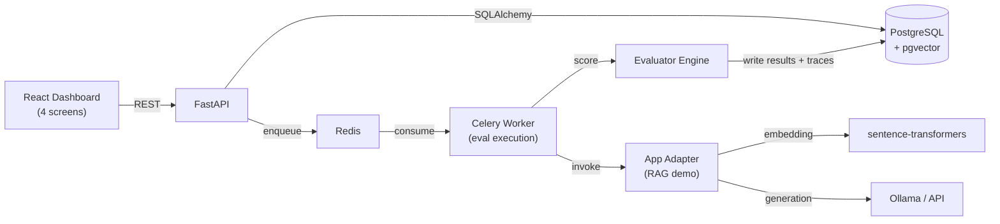

# EvalForge AI — A- Build Plan

## Purpose of this doc

This is the executable plan that takes the blueprint to A- portfolio standard. The blueprint describes *what the system contains*. This doc describes *what you build, in what order, and what good looks like at each gate*.

**Where this doc and the blueprint conflict, this doc wins.** Scope cuts here are locked — do not re-add features mid-build without rewriting this doc first.

---

## 1. A- Acceptance criteria

The project hits A- only when **every** item below is true. Missing any one drops it to B+.

### Functional
- [ ] One RAG demo app evaluated end-to-end (baseline vs candidate works)
- [ ] At least 500 eval cases run, full traces stored per case
- [ ] Bootstrap 95% CIs reported on every regression metric (pass rate, semantic sim, p95 latency, cost)
- [ ] Quality/latency/cost gate produces pass / warn / fail verdict
- [ ] Flaky-eval detection: N=5 reruns on a tagged subset, variance reported

### Rigor
- [ ] `docs/calibration_findings.md` exists with hand-labeled gold set methodology, confusion matrix, **at least one named, defensible finding**
- [ ] `benchmarks/results/` committed with measured numbers + reproduction commands
- [ ] At least one ablation: pass rate with vs without a specific evaluator

### Operational
- [ ] `docker compose up` brings full stack live on Windows + macOS
- [ ] CI runs tests + lint on push, badge visible in README
- [ ] Demo path documented — from clone to seeing a comparison verdict in under 5 minutes

### Communication
- [ ] One architecture doc with diagram + component contracts
- [ ] README opens with: what it does, who it's for, headline numbers, screenshot, demo command
- [ ] One 90-second demo video committed (mp4 or gif in repo)

If any box is unchecked, this is not A-.

---

## 2. Scope decisions (locked)

### Cut from blueprint

| Cut | Reason |
|---|---|
| Simple QA demo app | Coverage absorbed by RAG app |
| Summarization demo app | Same |
| LLM-as-judge as a default evaluator | Folded into calibration study only |
| Failure clustering (blueprint §5 / Phase 6.4) | Time sink, not load-bearing |
| Apps list page, eval suites page, run history page | Folded into Overview |
| "20 prompt/model versions" benchmark target | Vanity metric, no quality dimension |
| Multi-evaluator suite manager UI | Use config files; UI not worth the time |
| Per-suite settings UI | Same — config-driven |

### Kept from blueprint
- App + version + suite + case + run + comparison core
- Async runner via Celery + Redis
- Trace store per eval case
- Bootstrap CI regression detection
- Evaluator calibration concept (now first-class, see §9)
- Flaky-eval detection
- pgvector for embedding cache

### Added beyond blueprint
- **Calibration findings writeup** promoted from "advanced" to required deliverable
- **Hand-labeled gold set** (~50 cases) checked into repo with labeling rubric
- **Cost simulator** using published token rates so "cost" is a measurable evaluator without a paid API

---

## 3. Architecture (concrete)



### Component contracts (the part that matters)

**API → Worker (run trigger)**
```
POST /runs
body: { app_version_id, suite_id, evaluator_config_id }
→ creates eval_run row, enqueues N tasks (one per case)
→ returns run_id
```

**Worker task contract**
```
task(case_id, run_id, version_id):
    1. Load case + version config
    2. Call app adapter → get output + retrieved + metadata
    3. Run all configured evaluators on (case, output)
    4. Persist eval_run_item + trace
    5. Update run status counters
```

**Adapter contract (every demo app implements this)**
```python
def run(question: str, version_config: dict) -> AdapterOutput:
    # returns:
    # {
    #   answer: str,
    #   retrieved_chunks: list[{doc_id, chunk_text, score}],
    #   prompt_used: str,
    #   model_used: str,
    #   latency_ms: int,
    #   estimated_cost_usd: float,
    #   trace_steps: list[dict]   # for trace viewer
    # }
```

Decoupling adapters from the runner is the part that makes this an evaluation *platform* and not a demo. Future apps plug in via this contract.

---

## 4. Data model decisions

Beyond the table list in the blueprint:

- `eval_run_items.status` is an enum: `queued | running | completed | errored | timed_out`. Not free text.
- Traces stored as JSONB in `traces.payload` with index on `eval_run_id` only. Do not normalize trace fields into columns — they vary by app type and you'll regret schema migrations.
- Embedding cache: `embedding_cache(text_hash, model_id, vector)`. Avoids recomputing sentence-transformer embeddings for repeated reference texts.
- `regression_reports` stores point estimates **and** bootstrap CI bounds for every metric. Never store points alone.
- `eval_results` is one row per `(run_item, evaluator)` pair, not one row per item. Lets you add evaluators without schema changes.
- Soft-delete: none. Hard delete with cascade. This is a portfolio project, not a SaaS.

### Migration discipline
- Alembic from day one
- One migration per PR
- Never edit a merged migration

---

## 5. The RAG demo app — spec

### Why RAG only
RAG exercises every evaluator type the blueprint listed: retrieval hit rate, faithfulness, semantic similarity, fact-match, forbidden-claim detection. One app gives full evaluator coverage. The Simple QA and Summarization apps in the blueprint add surface area, not depth.

### Corpus
- 200–500 markdown docs
- Source: Python stdlib docs (public, stable, well-known, easy to write questions about) or a curated subset of HotpotQA passages
- Documented in `datasets/demo_rag/README.md` with the exact source URL/commit + license note

### App contract — see §3

### Versions to ship (4)
| Version | Config | Purpose |
|---|---|---|
| `v1_baseline_bge_top3` | BGE-small embeddings, top-3 chunks, basic prompt | The baseline |
| `v2_candidate_bge_top8` | Same model, top-8 chunks | Test: does more context help? |
| `v3_candidate_prompt_rewrite` | top-3, refined prompt with explicit "answer only from context" | Test: does prompt discipline reduce hallucination? |
| `v4_candidate_local_llm` | top-3, Ollama llama3.2-3b for generation | Test: cost-quality tradeoff with local LLM |

This gives four real comparison axes — context size, prompt design, model swap, cost tradeoff.

### Eval case generation (500 cases)
- **300 auto-generated** — LLM generates questions about specific paragraphs in the corpus. Validate by spot-checking 30.
- **100 hand-written edge cases** — multi-hop, ambiguous wording, "answer not in corpus"
- **100 adversarial** — jailbreak attempts, refusal probes, hallucination bait

Tag every case: `easy | edge_case | hallucination_risk | retrieval_required | reasoning_required | safety_sensitive`. Store as JSONL in `datasets/demo_rag/cases.jsonl`.

---

## 6. Evaluator implementations

| Evaluator | Algorithm | Library | Notes |
|---|---|---|---|
| Exact match | string equality | stdlib | Useful for fact-extraction cases |
| Contains-keywords | substring/regex over `expected_facts` list | re | Track which facts hit/miss for failure analysis |
| Semantic similarity | cosine on sentence-transformer embeddings | `sentence-transformers` (all-MiniLM-L6-v2) | Cache embeddings in pgvector |
| Retrieval hit rate | did `expected_chunk_id` appear in retrieved? | custom | Requires expected chunk in case metadata |
| Retrieval faithfulness | NLI: does answer entail from retrieved context? | `transformers` (`cross-encoder/nli-deberta-v3-base`) | **Slowest evaluator** — see risk §15 |
| Forbidden claim | regex pass, then semantic-sim fallback against forbidden list | re + sentence-transformers | Two-stage: cheap first, expensive only if cheap misses |
| Latency threshold | `recorded_latency_ms < threshold` | stdlib | Trivial |
| Cost threshold | `estimated_cost < threshold` | stdlib | Cost from simulator |
| LLM-judge | prompt a model to rate output 1-5 against expected | OpenAI / Anthropic / Ollama | **Only enabled in calibration mode** — not part of default eval suite |

### Cost simulator
- Token counts via `tiktoken` (for OpenAI-family models) and `transformers` tokenizers for others
- Multiply by published $/1K token rates committed in `config/model_costs.yaml`
- Re-run from cached prompts/responses if rates change

---

## 7. Statistical rigor — bootstrap CIs

### Why bootstrap
Pass-rate deltas of 1–2% on 500 cases are within sampling noise. A point estimate of "+1.4% pass rate" looks meaningful and is not. Bootstrap CIs separate signal from noise and make the gate defensible in an interview.

### Protocol
- For every regression metric: pass rate, semantic similarity mean, p95 latency, cost mean, hallucination rate
- 1000-sample bootstrap, BCa-adjusted intervals
- Library: `scipy.stats.bootstrap`
- Report **point + CI bounds**, never point alone

### Gate logic
```
For pass rate (higher-is-better):
    gate.fail   if candidate_pass_upper < baseline_pass_point - tolerance
    gate.warn   if candidate_pass_point < baseline_pass_point - tolerance AND CIs overlap
    gate.pass   otherwise

For p95 latency (lower-is-better):
    gate.fail   if candidate_p95_lower > baseline_p95_point + tolerance
    gate.warn   if candidate_p95_point > baseline_p95_point + tolerance AND CIs overlap
    gate.pass   otherwise

For cost (lower-is-better): same pattern as latency
```

Tolerances are configurable per app, stored in `gate_rules`. Default tolerance is 2% for quality, 10% for latency, 20% for cost — but make them adjustable.

### What "significant regression" means
A regression is reported as **statistically significant** when the candidate CI does not overlap the baseline CI for that metric. This is the language to use in the dashboard and resume bullets.

---

## 8. Flaky-eval detection

### Protocol
- For cases tagged `nondeterministic` (or any subset chosen at run config time):
  - Run N=5 times per version
  - Track per-case standard deviation across runs
- Classify each case:
  - **Stable**: σ < 0.05 on the primary evaluator score
  - **Flaky**: 0.05 ≤ σ < 0.20
  - **Inconclusive**: σ ≥ 0.20

### Use
- Flaky cases excluded from the gate decision (or weighted down)
- Flaky case count surfaced in the comparison report
- The exclusion is itself a thing to point at in interviews

---

## 9. The A- earner — Calibration Study

**This is the single feature that lifts EvalForge from B+ to A-.** Build everything else first. This is Phase 6 work.

### Setup
- Pick **50 RAG eval cases** stratified across tags:
  - 10 easy
  - 10 hallucination_risk
  - 10 retrieval_required
  - 10 reasoning_required
  - 10 adversarial
- For each case × each version (50 × 4 = 200 outputs), gather three signals:
  - Semantic similarity score
  - LLM-judge score (1-5, judge prompt committed to `evaluators/llm_judge_prompt.md`)
  - **Your hand label** (1-5 on a rubric committed to `docs/labeling_rubric.md`)

### Hand-labeling protocol
- ~10 min per case, ~8–10 hours total
- Track self-agreement: label 10 cases twice with at least a day between
- Report self-agreement Cohen's kappa in the findings doc — this is your honesty signal

### Analysis (in `analysis/calibration.ipynb`, committed)
1. Pearson + Spearman correlation between each automated evaluator and your label
2. Confusion matrix: bin scores into pass / borderline / fail (use 0.5 / 0.7 cutoffs for semantic sim; 3 / 4 cutoffs for judge); cross-tabulate
3. Disagreement analysis: cases with largest |semantic_sim_score − judge_score|. Look for pattern.
4. Per-tag breakdown: does evaluator reliability vary by case type?
5. Failure-mode taxonomy: when evaluators are wrong, what kind of wrong?

### Required deliverable: `docs/calibration_findings.md`
Required sections:
1. **Methodology** — gold set construction, labeling rubric link, self-agreement kappa, N per stratum
2. **Headline numbers** — Pearson + Spearman per evaluator, overall agreement rate
3. **At least one named finding** — concrete, defensible. Examples (you must find your own):
   - "LLM-judge over-rates fluent but unfaithful answers — 23% of cases where judge ≥4 have faithfulness <0.5"
   - "Semantic similarity is unreliable on multi-hop reasoning — correlation drops from 0.71 (single-hop) to 0.34 (multi-hop)"
   - "Retrieval hit rate is a stronger predictor of human-judged correctness than answer-side semantic sim on retrieval_required cases"
4. **Implication** — which evaluator should you trust for which case type? Recommend a weighting scheme.
5. **Limitations** — N=50, single labeler, single domain, English only

The **named finding** is the part interviewers will dig into. Spend the time to find a real one — at least one will emerge from the data if you look honestly.

---

## 10. Benchmark protocol

Everything committed under `benchmarks/`, results to `benchmarks/results/YYYY-MM-DD/`.

| Benchmark | Measures | Reproduction |
|---|---|---|
| `throughput.py` | Eval cases/min at varying worker concurrency | `python benchmarks/throughput.py --cases 500 --workers 1,2,4,8` |
| `regression_detection.py` | Recall on synthetic injected regressions | `python benchmarks/regression_detection.py` |
| `evaluator_latency.py` | Per-evaluator latency distribution | `python benchmarks/evaluator_latency.py` |
| `api_latency.py` | p50/p95 of dashboard endpoints under load | uses `wrk` or `locust` |

Results saved as JSON. Commit them.

### Synthetic regression injection (the credibility benchmark)
- Take a passing version (e.g., v1_baseline)
- Mutate it in 20 known-bad ways:
  - Drop the system instruction
  - Lower top-k to 1
  - Swap to a weaker model (without telling the gate)
  - Inject a typo in the prompt
  - Change retrieval scoring (e.g., random)
  - Truncate retrieved context aggressively
- Measure: how often does the gate flag these as `fail` (not `warn`, not `pass`)?
- **Target: ≥85% recall on the 20 injected regressions.** Report by mutation type.

---

## 11. Dashboard scope (locked: 4 screens)

1. **Overview**
   - Recent runs (5 most recent, with status)
   - Active comparisons (with verdict pill)
   - System health: worker queue depth, recent errors, cases run last 24h
2. **Run detail**
   - Run metadata, progress bar, per-case status table
   - Drilldown to trace (modal/drawer, not a separate page)
3. **Comparison**
   - **Top:** gate verdict pill + key deltas (pass rate, p95 latency, cost) with CIs
   - **Middle:** charts — pass rate by tag, latency distribution, cost
   - **Bottom:** failure table with filters (tag, evaluator, failure reason)
4. **Calibration**
   - Scatter plots: each evaluator vs hand-label
   - Disagreement examples table (clickable to trace)
   - Per-tag reliability table

**Trace viewer** is a modal/drawer triggered from Run detail and Comparison, not its own route.

What gets cut if behind schedule: the disagreement examples table on Calibration screen (defer to "polish week"). Never cut Calibration screen entirely — it's the visible proof of the A- earner.

---

## 12. Phase plan

**8 weeks at ~25 focused hours/week.** Stretches to 10 if part-time.

| Week | Phase | Deliverables | Exit gate |
|---|---|---|---|
| 1 | Phase 0 — scaffold | Repo, Docker Compose, Postgres + Redis up, React shell, CI green | `docker compose up` brings up everything, CI runs on push |
| 2 | Phase 1 — registry CRUD | App/version/suite/case models + endpoints, JSONL importer | Can create app, version, suite, import 100 cases via API |
| 3 | Phase 2 — async runner | Celery + Redis, run trigger, case-level worker tasks, status tracking | Trigger a run, see cases transition queued → running → completed, outputs persisted |
| 4 | Phase 3a — basic evaluators | Exact match, contains, semantic sim, latency, cost | Every run item has evaluator results + pass/fail |
| 5 | Phase 3b — hard evaluators + RAG app | Retrieval hit rate, faithfulness, forbidden claim. RAG demo app + corpus. 500-case run works | One full 500-case run completes with all evaluators reporting |
| 6 | Phase 4 — comparison + gates | Bootstrap CIs, gate logic, regression report | Trigger comparison, see verdict pill, deltas with CIs |
| 7 | Phase 5 — dashboard | 4 screens shipped, trace drawer works | Demo path: clone → docker up → trigger comparison → see verdict in ≤5 min |
| 8 | Phase 6 — calibration + polish | Gold set labeled, findings doc written, benchmarks run + committed, README + demo video | Every box in §1 checked |

### Cut order if behind schedule (decide week 5)
1. Disagreement-examples table on Calibration screen → "polish" item
2. Forbidden-claim evaluator → defer
3. v4 (Ollama local LLM) version → defer
4. v3 version → defer

**Never cut:**
- Calibration study (the A- earner)
- Bootstrap CIs (the rigor signal)
- One full 500-case end-to-end run with at least 3 versions

---

## 13. Interview defense prep

Likely questions + answer outlines. Internalize, don't memorize.

**Q: Why bootstrap CIs and not a t-test?**
Pass rate is a bounded proportion, often non-normal. Bootstrap is distribution-free and BCa-adjusted intervals correct for skew. Also easier to communicate: "we resampled 1000 times; candidate beat baseline in X% of resamples."

**Q: How do you handle evaluator disagreement?**
Quantified in the calibration study on N=50. Semantic sim is reliable for fluent-similarity, retrieval hit rate is reliable for grounding. LLM-judge has a measured over-rating bias on unfaithful fluent answers — we use it as a tiebreaker only, not a primary signal. See findings doc.

**Q: Your gold set is N=50 and one labeler — how do you know it's reliable?**
Self-agreement Cohen's kappa on 10 repeated cases: [your number]. N=50 is a limitation, documented. The methodology generalizes — N=500 with multiple labelers is the same code path; the bottleneck is labeling time, not the system.

**Q: How would this scale to 1M eval cases?**
Eval execution is embarrassingly parallel — add workers, Redis backpressures, Postgres scales fine for this row count. Trace storage is JSONB indexed by run_id; queries are bounded per run. The real bottleneck is the faithfulness NLI evaluator (~500ms/case on CPU). Path to scale: quantize the NLI model, batch-infer on GPU, or distill.

**Q: Why not LangChain / Ragas / Promptfoo?**
Wrote the eval pipeline from scratch to control the metrics and own the rigor. Ragas/Promptfoo are good products; this project demonstrates the engineering underneath. Specifically the bootstrap regression gates and the calibration study aren't in either out of the box.

**Q: What would you do differently next time?**
The faithfulness NLI evaluator is the latency floor — would distill a smaller model or use an entailment proxy. Also: multi-labeler calibration from day one would be stronger statistically. And I'd start the gate-tolerance tuning earlier — got it right by week 7, should've prototyped in week 4.

**Q: What's the most surprising thing you found?**
[Your real finding from calibration.] If you don't have one, the project isn't done.

**Q: How do you prevent the calibration study from being circular — i.e., you tune the eval to match your labels?**
Two safeguards: (a) labeling rubric committed before scoring was inspected; (b) evaluator weights chosen on a 30-case training half, reported on a 20-case held-out half. Held-out numbers are the headline.

---

## 14. Resume bullets (template)

Fill the bracketed numbers after you measure them. **Do not invent numbers.**

- Built **EvalForge AI**, an LLM/RAG evaluation platform running **[500]+** async eval cases across prompt/model/retriever versions with FastAPI, Celery, Redis, PostgreSQL, and React; surfaces baseline-vs-candidate regressions with bootstrap-CI gates on quality, latency, and cost.
- Implemented **[8]** evaluators (semantic similarity, retrieval faithfulness via NLI, hit rate, exact match, cost/latency thresholds) with per-case trace storage; sustained **[N]** cases/min on **[N]** workers with p95 dashboard API latency under **[N]** ms.
- Conducted an evaluator calibration study on a hand-labeled gold set (N=**[50]**): measured correlation between automated evaluators and human labels, found that **[your specific finding]**, and used the result to weight evaluators per case type.
- Designed bootstrap-based regression gates to separate significant deltas from sampling noise; caught **[≥85]**% of synthetic injected regressions in benchmark suite while keeping false-alarm rate under **[N]**%.

### Bullet-writing rules
- One verb per bullet, past tense ("built", "implemented", "measured")
- Always a number, always something measured (not "designed to")
- Tools/libraries named explicitly — recruiters search for them
- Last bullet should be the finding from calibration — that's the differentiator

---

## 15. Risks and mitigations

| Risk | Likelihood | Impact | Mitigation |
|---|---|---|---|
| Faithfulness NLI too slow for 500 cases | High | High | Subsample to 100 for faithfulness only; document why. Or use a smaller cross-encoder. |
| Gold-set labeling takes longer than 10hr budget | High | Med | Cap at 10min/case hard. Hand-label 30 first, see if finding emerges. Only push to 50 if needed for stat power. |
| Calibration finding is "all evaluators agree closely" — boring | Medium | High | Inject more adversarial cases in gold set. Disagreement concentrates there. If still no finding, that *is* the finding ("on the case mix tested, evaluators agree closely — therefore deploying any one is safe"). |
| Trying to add a 5th screen "because it's nice" | Medium | Med | Re-read §11. Don't. |
| Building this in parallel with IncidentLens | High if you try | Very high | Don't start IncidentLens until week 8 box checks are all green. |
| Postgres pgvector setup pain on Windows | Medium | Low | Use the official Docker image; don't try to install pgvector on bare-metal Windows. |
| Ollama setup not reproducible across reviewers' machines | Medium | Low | v4 (Ollama) is the optional version. Document that v4 requires `ollama pull llama3.2:3b`; degrade gracefully if absent. |
| You measure something and the number is bad | Medium | Low (this is fine) | Report the bad number honestly. "Bootstrap caught 78% of injected regressions, not 85% — here's the failure-mode analysis." That's *stronger* than a clean 85%. |

---

## 16. What "done" looks like

When you can do this end-to-end from a fresh clone in under 10 minutes, EvalForge is shippable:

1. `git clone && cd evalforge-ai`
2. `docker compose up -d`
3. `make seed` (creates RAG demo app + corpus + 500 cases)
4. `make run-comparison BASELINE=v1 CANDIDATE=v2`
5. Open `http://localhost:5173/comparisons/latest`
6. See verdict pill + deltas with CIs
7. Click into a failed case → trace drawer opens
8. Click "Calibration" → see scatter plots + the named finding

If any of these steps require explanation or fail silently, it's not done.

---

## 17. After EvalForge ships

Do not start IncidentLens until:
- [ ] EvalForge README has the headline numbers measured
- [ ] Demo video is recorded and committed
- [ ] One non-you person has cloned + run it successfully (find one friend, watch them, fix what breaks)
- [ ] Calibration findings doc is finalized

Only then move to IncidentLens. The pair only works if EvalForge is the strong one — splitting attention early produces two B+s instead of one A- and one strong B+.
