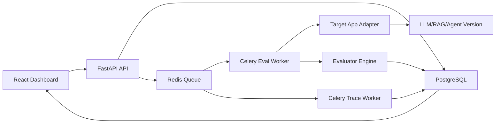

# EvalForge AI Project Blueprint

## 1. Project Decision

**Project name:** EvalForge AI

**Positioning:** Production-grade evaluation and regression testing platform for LLM, RAG, and agentic applications.

**Target resume score:** 9/10 if executed with real benchmarks, clean architecture, dashboards, CI/CD, and defensible metrics.

**One-line idea:**

> EvalForge AI lets developers compare prompt, model, retriever, and agent versions by running automated eval suites, detecting regressions, storing traces, and enforcing quality, latency, and cost gates before deployment.

This is not a chatbot project. This is infrastructure for testing AI systems.

## 2. Why This Project Is Strong

Modern AI systems fail in ways normal software tests do not catch. A prompt change may improve one example and silently break 50 others. A cheaper model may reduce cost but increase hallucination. A retriever change may improve latency but reduce answer faithfulness. EvalForge is built around this real production problem.

This project signals:

- ML engineering maturity: eval metrics, model comparison, hallucination checks, evaluator calibration.
- Backend depth: FastAPI APIs, Celery workers, Redis queues, PostgreSQL schema, async runs.
- Production thinking: traces, dashboards, regression gates, CI/CD, benchmark reports.
- Free-tier feasibility: local embeddings, local/small models, simulated cost, optional limited API usage.

## 3. What Problem It Solves

### Problem

LLM and RAG applications are hard to update safely. Developers often test a few examples manually, ship a prompt/model/retriever change, and later discover regressions in edge cases.

### Solution

EvalForge provides a repeatable evaluation pipeline:

1. Register an AI application.
2. Add prompt/model/retriever versions.
3. Upload or generate eval test cases.
4. Run evals asynchronously at scale.
5. Store output, latency, cost, retrieved context, and traces.
6. Compare candidate version against baseline.
7. Detect regressions using statistical and rule-based gates.
8. Show failure clusters and trace-level debugging in a dashboard.

## 4. MVP Definition

The MVP should answer this:

> Given two versions of an LLM/RAG app, can EvalForge run 500 eval cases, compare quality/latency/cost, identify regressions, and show which test cases failed with traces?

### MVP Features

- App registration.
- Version registration: baseline and candidate.
- Eval suite creation.
- Eval case upload using CSV or JSONL.
- Async eval execution with Celery.
- Metrics:
  - exact match
  - contains keyword
  - semantic similarity
  - latency
  - estimated cost
  - retrieval hit rate
  - faithfulness score
- Regression report:
  - pass rate delta
  - average quality delta
  - p50/p95 latency delta
  - estimated cost delta
  - failed cases grouped by reason
- React dashboard:
  - run list
  - run details
  - baseline vs candidate comparison
  - failure case table
  - trace viewer

## 5. Advanced Version

The advanced version is what pushes the project above a normal dashboard.

### Hard Technical Core

1. **Evaluator calibration**
   - Compare multiple evaluators on the same cases.
   - Track disagreement between semantic score and LLM-judge score.
   - Add a small manually labeled gold set.
   - Report evaluator reliability.

2. **Flaky eval handling**
   - Re-run nondeterministic cases multiple times.
   - Track variance across runs.
   - Mark cases as stable, flaky, or inconclusive.

3. **Statistical regression detection**
   - Use confidence intervals or bootstrap sampling.
   - Avoid failing a candidate version because of tiny random changes.
   - Report "significant regression" vs "small/noisy change".

4. **Trace-level observability**
   - Store each step of the app execution.
   - Example trace: input -> retrieved chunks -> model prompt -> model output -> evaluator output.
   - Make failures explainable.

5. **Quality-cost-latency gates**
   - Example gate:
     - quality drop must be less than 2 percent
     - p95 latency must be under 2 seconds
     - cost increase must be under 20 percent
     - hallucination rate must not increase

## 6. Suggested Tech Stack

### Backend

- Python 3.11+
- FastAPI
- SQLAlchemy or SQLModel
- Pydantic
- Alembic migrations

### Workers

- Celery
- Redis as broker/result backend

### Database

- PostgreSQL
- Optional pgvector for semantic comparison cache and embedding search

### ML and Evaluation

- sentence-transformers for local embeddings
- scikit-learn for clustering and metrics
- Ollama for local LLM demos, optional
- OpenAI/Gemini API only for small demo runs, optional

### Frontend

- React
- Vite
- TanStack Query
- Recharts or ECharts
- Tailwind or simple CSS

### DevOps

- Docker Compose
- GitHub Actions
- pytest
- Ruff
- mypy optional
- Makefile or task runner

## 7. System Architecture



## 8. Core Components

### 8.1 App Registry

Stores applications that can be evaluated.

Examples:

- customer-support-rag
- sql-agent
- summarization-service
- local-demo-qa

Responsibilities:

- create app
- list apps
- attach eval suites
- attach versions

### 8.2 Version Registry

Stores each candidate version.

Version dimensions:

- prompt version
- model name
- retriever settings
- temperature
- top-k
- system instruction
- tool configuration

Example versions:

- v1_baseline_gpt4o_top5
- v2_candidate_llama_top8
- v3_prompt_rewrite_cost_optimized

### 8.3 Eval Suite Manager

Stores groups of test cases.

Eval case fields:

- input
- expected output
- expected facts
- forbidden claims
- reference context
- tags
- difficulty
- evaluator types

Tags should include:

- easy
- edge_case
- hallucination_risk
- retrieval_required
- reasoning_required
- safety_sensitive

### 8.4 Eval Runner

Responsible for:

- creating run jobs
- splitting cases into worker tasks
- retrying failed jobs
- storing raw outputs
- collecting latency and cost
- triggering evaluator engine

### 8.5 Evaluator Engine

Evaluator types:

- exact match
- regex match
- contains expected facts
- forbidden claim detection
- semantic similarity
- retrieval hit rate
- retrieval faithfulness
- LLM-as-judge, optional
- latency threshold
- cost threshold

### 8.6 Regression Analyzer

Compares baseline and candidate.

Outputs:

- total cases
- pass rate delta
- quality delta
- latency delta
- cost delta
- failed case ids
- regression severity
- gate decision: pass, warn, fail

### 8.7 Trace Store

Stores structured traces for each eval case.

Trace fields:

- input
- app version
- prompt
- retrieved context
- output
- evaluator scores
- latency
- cost
- error logs

### 8.8 Dashboard

Screens:

- overview dashboard
- apps list
- eval suites
- run history
- baseline vs candidate comparison
- failed cases
- trace viewer
- evaluator calibration page

## 9. Database Model

Minimum tables:

- `apps`
- `app_versions`
- `eval_suites`
- `eval_cases`
- `eval_runs`
- `eval_run_items`
- `eval_results`
- `traces`
- `regression_reports`
- `gate_rules`
- `evaluator_configs`

### Important Relationships

- one app has many versions
- one app has many eval suites
- one eval suite has many eval cases
- one eval run belongs to one app version
- one eval run has many run items
- one run item has one trace
- one regression report compares two eval runs

## 10. API Design

### App APIs

- `POST /apps`
- `GET /apps`
- `GET /apps/{app_id}`
- `POST /apps/{app_id}/versions`
- `GET /apps/{app_id}/versions`

### Eval Suite APIs

- `POST /apps/{app_id}/suites`
- `POST /suites/{suite_id}/cases/import`
- `GET /suites/{suite_id}/cases`
- `GET /suites/{suite_id}/summary`

### Run APIs

- `POST /runs`
- `GET /runs`
- `GET /runs/{run_id}`
- `GET /runs/{run_id}/items`
- `GET /runs/{run_id}/traces/{case_id}`

### Comparison APIs

- `POST /comparisons`
- `GET /comparisons/{comparison_id}`
- `GET /comparisons/{comparison_id}/failures`
- `GET /comparisons/{comparison_id}/gate-decision`

## 11. Metrics To Track

### Quality Metrics

- pass rate
- semantic similarity average
- faithfulness score
- hallucination rate
- retrieval hit rate
- evaluator disagreement rate

### Performance Metrics

- average latency
- p50 latency
- p95 latency
- worker throughput
- queue wait time
- failed job rate

### Cost Metrics

- estimated tokens
- estimated cost per run
- cost per passed case
- cost delta against baseline

### Reliability Metrics

- flaky test rate
- retry count
- evaluator error rate
- run completion rate

## 12. Data Sources and Demo Apps

You need demo applications so EvalForge has something to test.

### Demo App 1: Simple QA App

- Input: question
- Output: answer
- Eval: exact match, semantic similarity, forbidden claims

### Demo App 2: Mini RAG App

- Dataset: small public FAQ, Wikipedia snippets, or local markdown docs
- Eval: retrieval hit rate, answer faithfulness, semantic similarity

### Demo App 3: Summarization App

- Input: paragraph
- Output: summary
- Eval: length, key facts, forbidden hallucinations

## 13. Benchmark Targets

Use benchmark targets in the README and resume only after measuring them.

Initial targets:

- Run 500 eval cases in under 5 minutes on local machine.
- Store full traces for every case.
- Process at least 10 concurrent worker tasks.
- Compare 20 prompt/model versions.
- Detect injected prompt regressions with at least 90 percent recall on synthetic benchmark.
- Keep p95 API response latency under 300 ms for dashboard endpoints.

## 14. Project Phases

### Phase 0: Setup

- Create monorepo structure.
- Add backend, frontend, worker, and Docker Compose.
- Configure PostgreSQL, Redis, and migrations.
- Add CI with tests and linting.

Exit criteria:

- `docker compose up` starts API, worker, DB, Redis, and frontend.
- CI runs tests on push.

### Phase 1: App and Eval Suite Registry

- Create app registry.
- Create version registry.
- Create eval suite and eval case models.
- Add JSONL/CSV import.

Exit criteria:

- User can create an app, add versions, upload 100 eval cases, and view them in the UI.

### Phase 2: Async Eval Runner

- Add Celery tasks.
- Run eval cases asynchronously.
- Store outputs, errors, latency, and status.
- Add run progress tracking.

Exit criteria:

- User can trigger a run and watch status move from queued to running to completed.

### Phase 3: Evaluator Engine

- Implement exact match.
- Implement regex/keyword checks.
- Implement semantic similarity.
- Implement retrieval hit rate.
- Implement cost and latency evaluators.

Exit criteria:

- Every run item has evaluator results and pass/fail status.

### Phase 4: Regression Comparison

- Compare baseline vs candidate runs.
- Calculate deltas.
- Add gate rules.
- Generate regression report.

Exit criteria:

- User can see whether candidate version passes, warns, or fails.

### Phase 5: Trace Viewer and Dashboard

- Build dashboard pages.
- Add trace viewer.
- Add failure filtering by tag and evaluator.
- Add charts for pass rate, cost, and latency.

Exit criteria:

- A recruiter/interviewer can understand the system from the demo in 2 minutes.

### Phase 6: Advanced Differentiators

- Add flaky eval detection.
- Add evaluator calibration.
- Add bootstrap confidence intervals.
- Add failure clustering.
- Add generated benchmark report.

Exit criteria:

- Project has a clear hard technical core beyond CRUD and dashboards.

## 15. Suggested Repository Structure

```text
evalforge-ai/
  backend/
    app/
      api/
      core/
      db/
      models/
      schemas/
      services/
      evaluators/
      runners/
      comparisons/
      traces/
    tests/
  worker/
    tasks/
    adapters/
  frontend/
    src/
      pages/
      components/
      api/
      charts/
  datasets/
    demo_qa/
    demo_rag/
    demo_summarization/
  benchmarks/
  docs/
    architecture.md
    api.md
    eval_metrics.md
  docker-compose.yml
  README.md
```

## 16. Testing Strategy

### Backend Unit Tests

- evaluator scoring
- regression comparison
- gate rule logic
- cost estimation
- import validation

### Integration Tests

- create app -> create version -> import suite -> run eval -> compare result
- worker task retry behavior
- database persistence

### Benchmark Tests

- run 500 cases
- run 1000 cases
- simulate failing candidate
- simulate slower candidate
- simulate cheaper but lower-quality candidate

### Frontend Tests

- dashboard renders run status
- comparison page renders deltas
- failure table filters by evaluator and tag

## 17. What To Avoid

- Do not make this only a UI for uploading prompts.
- Do not depend on expensive paid APIs.
- Do not claim accuracy or cost savings without measured scripts.
- Do not build too many demo app types before the eval platform is strong.
- Do not overuse LangChain if it hides the engineering details you need to explain.

## 18. Resume Bullets To Aim For

Only use numbers after you actually measure them.

- Built an LLM evaluation platform executing 10K+ regression test cases across prompt, model, and retriever versions using FastAPI, Celery, Redis, PostgreSQL, and React.
- Designed quality, latency, and cost gates to detect regressions before deployment, with trace-level failure analysis for each eval case.
- Implemented semantic similarity, retrieval faithfulness, exact-match, keyword, and latency evaluators with configurable eval suites.
- Added flaky eval detection and baseline-vs-candidate comparison reports, reducing manual prompt testing effort in benchmark workflows.
- Created CI/CD and benchmark scripts to validate evaluator correctness, worker throughput, and p95 dashboard latency.

## 19. Interview Talking Points

Be ready to explain:

- Why normal unit tests are not enough for LLM apps.
- How semantic similarity differs from exact match.
- Why LLM-as-judge can be biased or unstable.
- How to reduce evaluator flakiness.
- How Celery workers scale eval runs.
- How you store traces without making queries slow.
- How gate thresholds are chosen.
- How to compare two versions fairly.
- What happens when evaluator metrics disagree.
- How to make the system free-tier friendly.

## 20. Final Build Standard

This project becomes resume-ready only when these are true:

- It has a working local demo.
- It has at least one demo app being evaluated.
- It runs hundreds or thousands of eval cases.
- It has stored traces and comparison reports.
- It has benchmark scripts with real measured outputs.
- It has CI passing.
- It has architecture docs and API docs.
- It has a dashboard that shows quality, cost, latency, and failures clearly.

