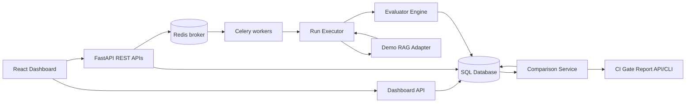
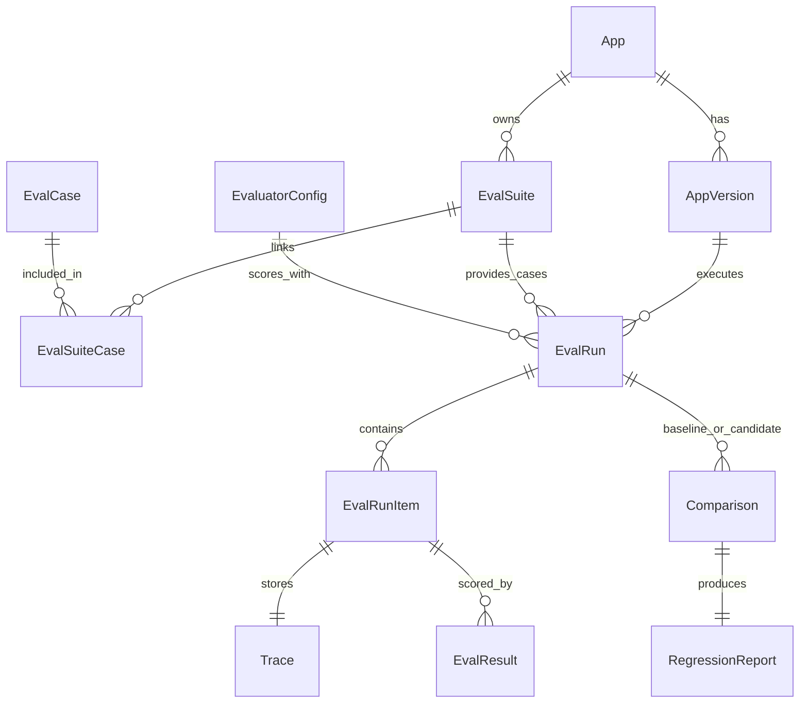
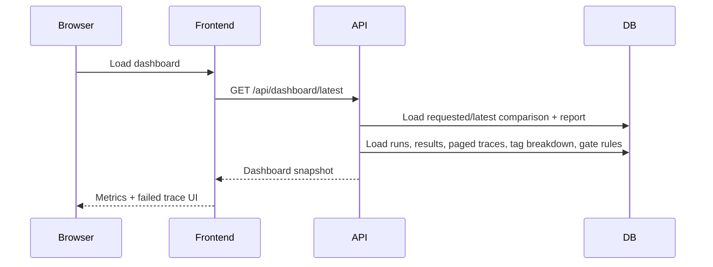

# Architecture

## System Shape

EvalForge AI is split into five layers:

1. **Registry layer**: apps, versions, suites, cases, evaluator configs.
2. **Execution layer**: run executor invokes app adapters and evaluators.
3. **Analysis layer**: comparison service computes metrics, confidence intervals, and gate decisions.
4. **CI/CD layer**: gate report API and CLI turn comparison results into deploy-blocking artifacts.
5. **Presentation layer**: dashboard API and React UI surface aggregate metrics and failed traces.



## Core Domain Model



## End-To-End Flow

1. User creates an app.
2. User registers two versions: baseline and candidate.
3. User creates an eval suite and imports cases.
4. User creates an evaluator config.
5. User triggers a run for the baseline version.
6. User triggers a run for the candidate version.
7. Run executor calls the adapter for each case.
8. Adapter returns answer, retrieved chunks, latency, cost, and trace steps.
9. Evaluator engine scores the output.
10. Trace and evaluator results are persisted.
11. Comparison service computes regression metrics and bootstrap CIs.
12. Gate rules produce pass/warn/fail.
13. Dashboard API returns the selected or latest comparison snapshot with failed-case pagination.
14. React dashboard shows metrics, failed cases, tag breakdowns, and trace evidence.

## Why The Adapter Boundary Matters

The adapter boundary keeps EvalForge from becoming only a Python-docs demo. Any future RAG or agent app can implement the same contract:

```python
def run(question: str, version_config: dict) -> AdapterOutput:
    ...
```

The runner does not need to know whether the adapter uses a local model, a remote API, a vector database, or a deterministic demo.

## Why Evaluators Are Separate Rows

Each evaluator writes one `EvalResult` row per case. This gives three benefits:

- New evaluators can be added without changing the trace schema.
- Failed evaluators do not destroy the whole run.
- Comparison logic can aggregate only the metrics it needs.

## Why Traces Are Separate From Run Items

Run items are small and frequently listed. Traces are larger and only opened when debugging. Keeping traces in a separate table keeps run lists fast while preserving full failure evidence.

## Dashboard Data Flow



In normal mode, a missing or unavailable `/api/dashboard/latest` response produces an explicit empty/error state. Demo data is used only when `VITE_DEMO_MODE=true`; the UI then labels its source as demo data. The packaged nginx server proxies `/api/*` to FastAPI.

## Current Deployment Model

Docker Compose defines:

- PostgreSQL with pgvector image
- Redis
- One-shot Alembic migration service
- FastAPI backend
- Celery worker
- Nginx-served frontend build

The Docker smoke workflow builds the packaged stack, waits for migration-aware readiness, completes 50 baseline and 50 candidate cases through Celery, validates the live dashboard payload and nginx API proxy, and uploads a measured throughput artifact. This path was also exercised locally against a fresh database during the August 2026 hardening pass.

## Scaling Path

EvalForge supports sync execution for deterministic tests and Celery execution for Redis-backed worker runs. The next scaling path is:

1. The API persists a run and enqueues one leased task per case through Redis.
2. Celery workers execute cases with late acknowledgements, bounded retries, delivery leases, and idempotent progress recounting.
3. A completion chord derives the final run state from terminal item rows, including evaluator failures.
4. Comparison reports are precomputed and dashboard aggregation uses bounded bulk queries.
5. The next scale step is an external blob store for large traces, queue partitioning by adapter/model capacity, and production load testing against real providers.
