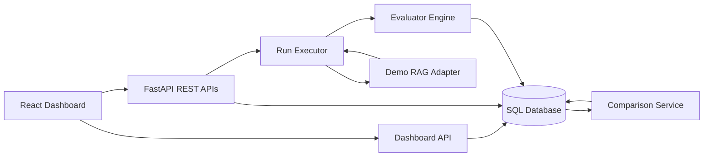
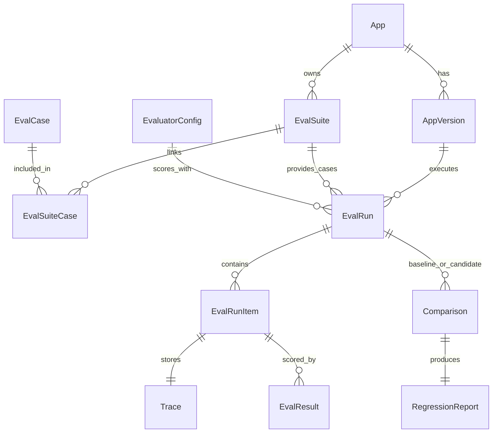
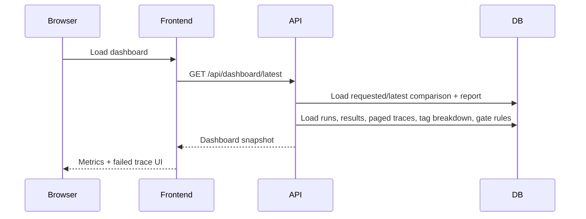

# Architecture

## System Shape

EvalForge AI is split into four layers:

1. **Registry layer**: apps, versions, suites, cases, evaluator configs.
2. **Execution layer**: run executor invokes app adapters and evaluators.
3. **Analysis layer**: comparison service computes metrics, confidence intervals, and gate decisions.
4. **Presentation layer**: dashboard API and React UI surface aggregate metrics and failed traces.



## Core Domain Model



## End-To-End Flow

1. User creates an app.
2. User registers two versions: baseline and candidate.
3. User creates an eval suite and imports cases.
4. User creates an evaluator config.
5. User triggers a run for the baseline version.
6. User triggers a run for the candidate version.
7. Run executor calls the adapter for each case.
8. Adapter returns answer, retrieved chunks, latency, cost, and trace steps.
9. Evaluator engine scores the output.
10. Trace and evaluator results are persisted.
11. Comparison service computes regression metrics and bootstrap CIs.
12. Gate rules produce pass/warn/fail.
13. Dashboard API returns the selected or latest comparison snapshot with failed-case pagination.
14. React dashboard shows metrics, failed cases, tag breakdowns, and trace evidence.

## Why The Adapter Boundary Matters

The adapter boundary keeps EvalForge from becoming only a Python-docs demo. Any future RAG or agent app can implement the same contract:

```python
def run(question: str, version_config: dict) -> AdapterOutput:
    ...
```

The runner does not need to know whether the adapter uses a local model, a remote API, a vector database, or a deterministic demo.

## Why Evaluators Are Separate Rows

Each evaluator writes one `EvalResult` row per case. This gives three benefits:

- New evaluators can be added without changing the trace schema.
- Failed evaluators do not destroy the whole run.
- Comparison logic can aggregate only the metrics it needs.

## Why Traces Are Separate From Run Items

Run items are small and frequently listed. Traces are larger and only opened when debugging. Keeping traces in a separate table keeps run lists fast while preserving full failure evidence.

## Dashboard Data Flow



If `/api/dashboard/latest` is unavailable, the frontend tries `/api/dashboard/demo`. If that is unavailable too, it uses local demo data. This keeps the UI usable during frontend-only work without hiding the backend boundary.

## Current Deployment Model

Docker Compose defines:

- PostgreSQL with pgvector image
- Redis
- FastAPI backend
- Celery worker
- Nginx-served frontend build

Docker runtime was verified locally on June 16, 2026. The Compose stack built and started successfully, `/healthz` returned `ok`, and a 50-case Celery seed completed both baseline and candidate runs through the worker path before computing the comparison gate.

## Scaling Path

EvalForge supports sync execution for deterministic tests and Celery execution for Redis-backed worker runs. The next scaling path is:

1. Keep the API request fast by creating the run and enqueueing tasks.
2. Use Redis as broker.
3. Run Celery workers for case execution.
4. Use atomic counter updates for run progress.
5. Keep trace writes bounded per case.
6. Precompute comparison reports so dashboard reads are cheap.

This is a clear next phase, not something to claim as already complete.
